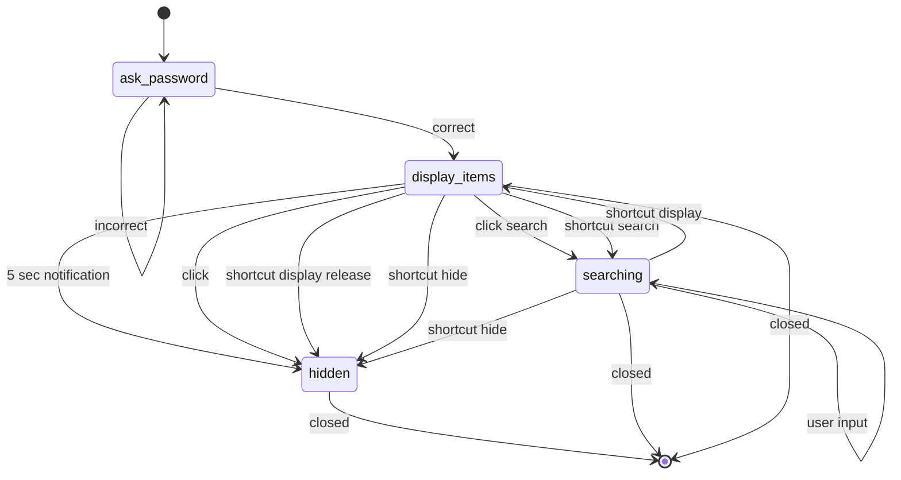

# State machine diagram

```mermaid
stateDiagram-v2

[*] --> ask_password

ask_password --> display_items : correct
ask_password --> ask_password : incorrect


display_items --> hidden: 5 sec notification
display_items --> hidden: click
display_items --> hidden: shortcut display release
display_items --> hidden: shortcut hide


display_items --> searching: click search
display_items --> searching: shortcut search


searching --> searching: user input
searching --> display_items: shortcut display
searching --> hidden : shortcut hide

hidden --> [*] : closed
searching --> [*] : closed
display_items --> [*] : closed

```
